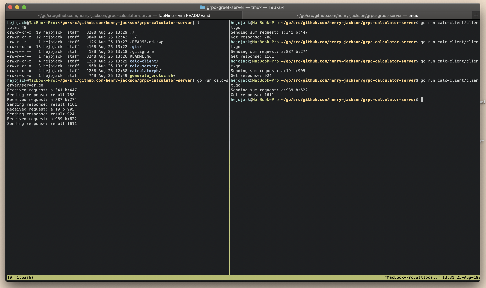
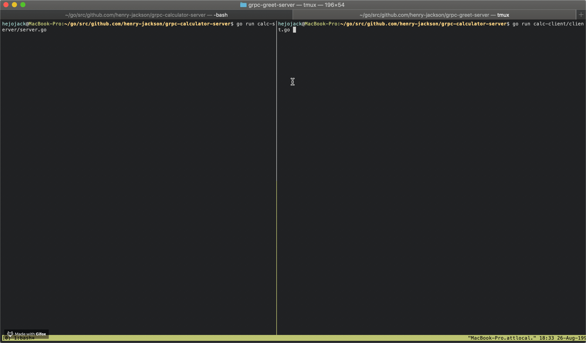
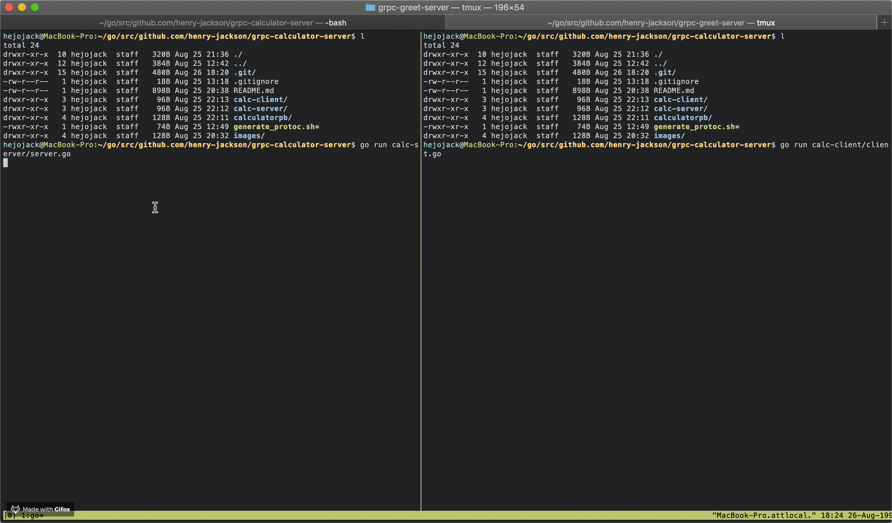

# grpc-calculator-server
> implements a basic gRPC API server that has unary, server streaming, client
> streaming, and bidirectional streaming methods along with sample client side
> code.

## How to Run
> Assumes you have already installed protoc, grpc-go, the Go language, etc. See [this
> repo](https://github.com/protocolbuffers/protobuf) for any help.

#### Server
In one session:
```sh
cd calc-server/
go run *.go
```

#### Client
> Client behavior can be altered by uncommenting certain lines in main() of
> calc-client/main.go
In another session:
```sh
cd calc-client/
go run *.go
```

## Examples
> See screenshots below for examples (server running on left and client
> executing requests on right)
> Note: Some examples were captured when files were named differently. Follow
> the instructions in [the How to Run section](#how-torun) for up to date filenames

#### Unary - Sum two numbers


#### Server streaming - Find prime factors of number


#### Client streaming - Calculate average of streamed inputs


#### Bidirectional streaming - Find maximum of streamed inputs
![bidirectional-streaming-screenshot](images/bidirectional-stream.gif]
